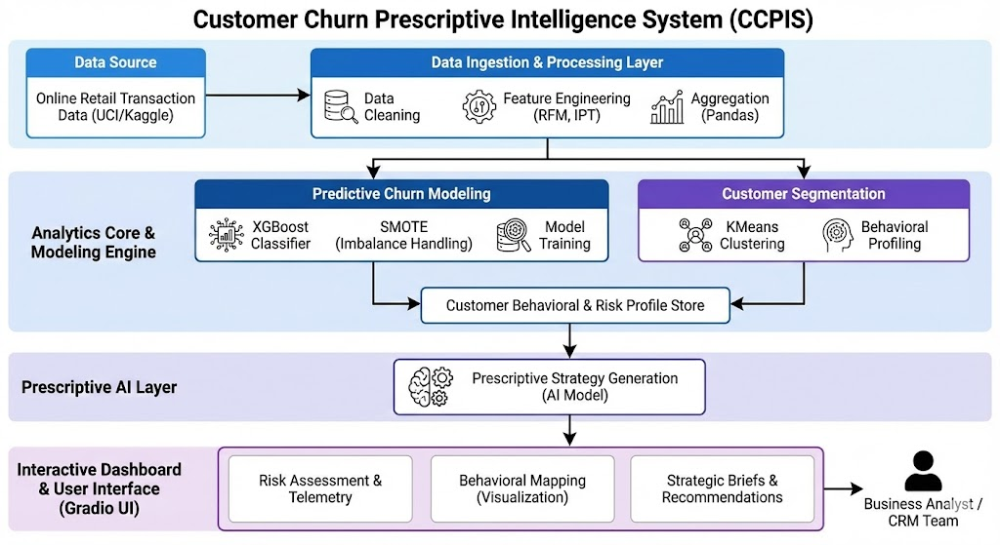
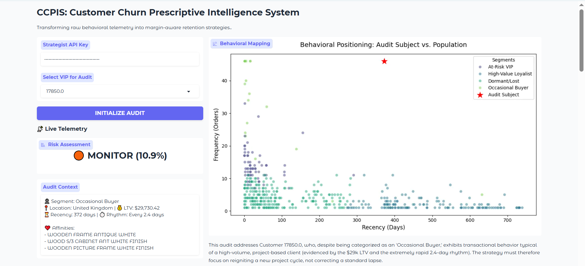
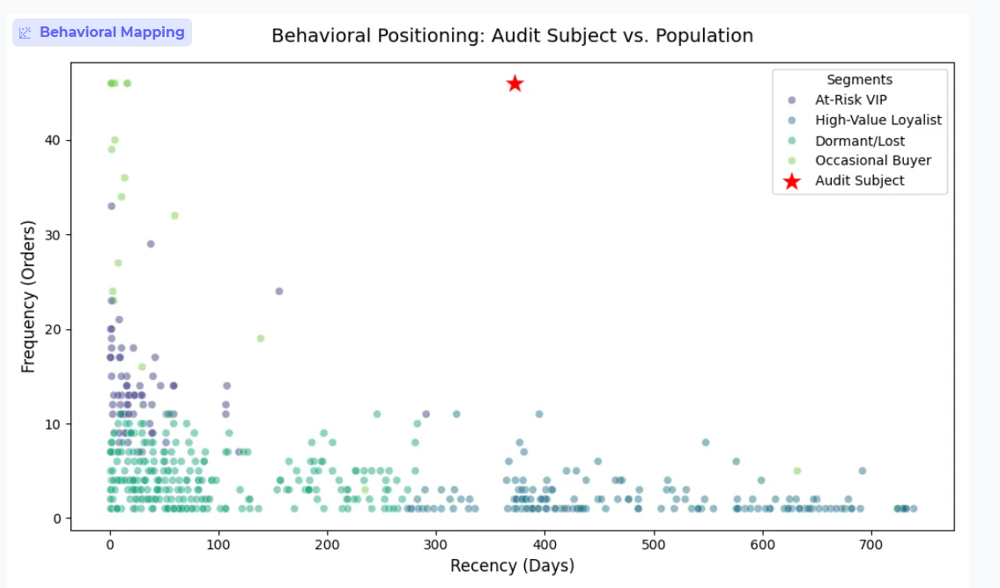
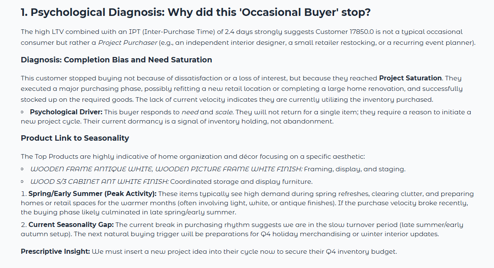

# 🚀 Customer Churn Prescriptive Intelligence System (CCPIS)

> An end-to-end customer analytics platform that predicts churn risk and generates AI-driven retention strategies using behavioral modeling and prescriptive intelligence.

CCPIS goes beyond traditional churn prediction by learning **customer purchase rhythm (Inter-Purchase Time)** and combining machine learning with **Generative AI reasoning** to deliver actionable, business-ready insights.

---

## 📌 Problem Statement

Most churn systems rely on static thresholds (example: no purchase in 90 days = churn).
This leads to:

* False churn detection
* Unnecessary discount campaigns
* Revenue leakage
* Poor customer experience

CCPIS solves this by introducing **behavior-aware churn modeling** and **AI-powered prescriptive decision support**.

---

## 📊 Dataset Used

This project is built using the **Online Retail II (UCI)** dataset from Kaggle:

**Source:** Online Retail II Dataset — UCI Machine Learning Repository (via Kaggle)

Dataset Characteristics:

* Real-world UK-based retail transaction data
* Invoice-level purchase behavior
* Customer-level transactional history
* High class imbalance (real churn scenario)

Why This Dataset Was Chosen:

* Mimics enterprise retail CRM environments
* Enables realistic churn labeling strategies
* Suitable for behavioral modeling and temporal analysis

---

## 🧠 System Capabilities

* Behavioral churn prediction using XGBoost
* Inter-Purchase Time (IPT) rhythm modeling
* Leakage-safe model training strategy
* Class imbalance handling with SMOTE
* Customer segmentation using KMeans
* AI-powered prescriptive recommendations (Gemini API)
* Interactive analytics dashboard (Gradio)
* Visual behavioral mapping of high-risk customers

---

## 🏗 System Architecture

The following diagram illustrates the end-to-end architecture of the **Customer Churn Prescriptive Intelligence System (CCPIS)**, from raw transactional data ingestion to AI-driven decision intelligence.




---

## 📊 Model Performance

* Validation ROC-AUC Score: **0.72**
* Training Methodology: Leakage-free modeling (Recency excluded)
* Optimization Techniques:

  * SMOTE oversampling
  * Log transformation on skewed variables

### Why 0.72 Is Strong

Customer churn prediction is a real-world noisy problem.
A 0.72 ROC-AUC provides reliable customer risk ranking, which is highly valuable for business prioritization and marketing strategy optimization.

---

## 💡 Key Innovation — Inter-Purchase Time (IPT)

Unlike traditional churn models, CCPIS models individual customer buying rhythm.

Example:

| Customer Type  | Purchase Cycle | Risk Interpretation   |
| -------------- | -------------- | --------------------- |
| Frequent Buyer | Every 10 days  | At risk at 20 days    |
| Seasonal Buyer | Every 100 days | Still safe at 90 days |

This significantly reduces false churn labeling.

---

## 🎯 Hyper-Personalization Engine

CCPIS enables **customer-level hyper-personalization** by combining:

* Behavioral segmentation
* Purchase frequency patterns
* Product affinity
* Customer lifetime behavior

This allows the system to:

* Assign tailored retention actions per customer
* Avoid blanket discount strategies
* Optimize campaign targeting
* Improve long-term customer value

---

## 🤖 Prescriptive Intelligence Layer

The AI engine analyzes:

* Customer churn probability
* Behavioral segment
* Purchase history
* Product affinity
* Geographic context

And generates:

* Retention strategy recommendations
* Campaign messaging ideas
* Discount vs engagement decision guidance
* Psychological churn drivers

This converts analytics into actionable business decisions.

---

## 🖥 Decision Intelligence Dashboard (Gradio)

The interactive Gradio dashboard provides:

* Live churn risk telemetry
* Behavioral segmentation view
* Visual customer positioning map
* AI-generated marketing playbooks
* VIP customer auditing

Designed as an internal CRM analytics command center.

---
## 🖼 UI Preview

Below are snapshots from the interactive **Gradio-based Decision Intelligence Dashboard**, showcasing churn risk insights and AI-driven recommendations.

### 📊 Main Dashboard Overview


### 📈 Churn Risk Distribution


### 🤖 AI Prescriptive Recommendation Panel


### 🤖 AI Recommendation – Alternative Views
.png)
.png)


---

## 🛠 Tech Stack

| Layer              | Technology            |
| ------------------ | --------------------- |
| Language           | Python                |
| Data Processing    | Pandas, NumPy         |
| Modeling           | XGBoost, Scikit-learn |
| Imbalance Handling | SMOTE                 |
| Clustering         | KMeans                |
| Visualization      | Matplotlib            |
| AI Reasoning       | Google Gemini API     |
| UI Layer           | Gradio                |

---

## 📂 Project Structure

```
Customer-Churn-Prescriptive-Intelligence-System/
│
├── app.py
├── config.py
│
├── data/
│   └── loader.py
│
├── features/
│   └── behavioral_engine.py
│
├── models/
│   ├── churn_model.py
│   └── segmentation.py
│
├── intelligence/
│   └── prescriptive_ai.py
│
├── dashboard/
│   └── ui.py
│
├── assets/
│   ├── screenshots/
│   └── diagrams/
│
├── requirements.txt
└── README.md
```

---

## ⚙ Installation

### Install Dependencies

```
pip install -r requirements.txt
```

---

## ▶ Run Application

```
python app.py
```

After running, the dashboard will open locally in your browser.

---

## 📈 Business Use Cases

* Customer retention optimization
* Marketing budget efficiency improvement
* VIP churn risk identification
* AI-assisted CRM decision making
* Customer lifetime value protection

---

## 🔮 Future Improvements

Planned enhancements:

* FastAPI backend integration
* Real-time data ingestion
* Model monitoring and drift detection
* Experiment tracking
* Cloud deployment
* CRM tool integration

---

## 👨‍💻 Author

Built as a real-world applied data science and AI systems portfolio project focused on customer analytics and business intelligence.

---

## ⭐ Support

If you find this project useful, consider giving the repository a star ⭐
It helps increase visibility and supports open learning.
